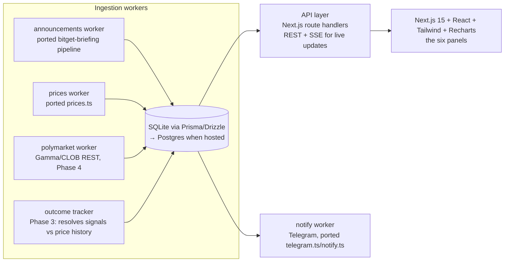

# FARSEER Dashboard — Complete Development Plan & Roadmap

**Audience: the Claude Code session running locally in `C:\FARSEER\FARSEERdashboard`.**
This document is the single source of truth for building the FarSeer dashboard. Read it
top to bottom before writing any code. It explains the reasoning, the architecture, what
already exists and can be ported from the `far-reach/Cryptonic` repo, and a precise,
phased roadmap with acceptance criteria.

---

## 0. Provenance — read this first, it is not boilerplate

This plan was drafted in a **remote cloud session attached to the `far-reach/Cryptonic`
GitHub repo**. That session could **not** access the local machine, and therefore could
**not read `C:\FARSEER\FARSEERdashboard\FarSeerLitepaper.pdf`** — the PDF exists only
locally and was never pushed to any GitHub repo (verified: no PDF and no mention of
"FarSeer" exists in any branch or the entire git history of `Cryptonic`, and no
`FARSEERdashboard` repo exists on the account).

Everything in this plan is therefore grounded in two things:

1. **Hard facts** from the `Cryptonic` codebase — the owner's existing, working systems
   (announcement-intelligence engine, trade signals, dashboards, prediction-market bot,
   token contracts). These are cited with exact paths and are safe to rely on.
2. **Assumptions** about FarSeer's product scope, inferred from the name, the folder, and
   the owner's project history. Every assumption is tagged `[A#]` so you can verify each
   one against the litepaper mechanically.

### Your mandatory Step 0 (before any code)

You are running locally, so **you can read the PDF this plan's author could not**:

1. Read `C:\FARSEER\FARSEERdashboard\FarSeerLitepaper.pdf` in full.
2. Walk the assumption register (§2.1). For each `[A#]`: confirm, correct, or delete.
3. Update this file in place with the corrections (keep the `[A#]` tags, mark each one
   `✅ confirmed` / `✏️ corrected: <what the litepaper actually says>`).
4. Only then start Phase 1. If the litepaper contradicts a whole phase (e.g. no token →
   drop Phase 6), delete that phase and note it in the changelog at the bottom.

If any of these conflict with the litepaper, **the litepaper wins** — this plan is the
map, the litepaper is the territory.

---

## 1. What FarSeer is (working thesis)

**One-liner [A1]:** FarSeer ("one who sees far") is a **crypto market
intelligence & forecasting dashboard** — a web app that turns raw market exhaust
(exchange announcements, prices, prediction-market odds) into ranked, explained,
actionable foresight: what happened, why it matters, what typically happens next, and a
tracked record of how those calls performed.

Why this is the high-confidence reading of the litepaper:

- The owner already **built and runs the core engine**: `packages/bitget-briefing` in
  `Cryptonic` scrapes the Bitget announcement center daily, classifies severity
  (critical/notable/info), scores importance (1–5 stars), extracts the *reason* from
  article bodies, derives **rule-based trade signals with entry/TP/SL brackets from live
  prices** (event-study heuristics: delistings −20…−70%, listing-day ~+6%,
  suspension/resumption arb gaps), renders daily + weekly briefings with an
  "environment gauge", and delivers to Telegram. It has been producing real briefings
  since 2026-07-14 (committed under `briefings/`).
- The owner also built a **Polymarket trading bot** (branch
  `claude/polymarket-trading-bot-i4idu4`, `polymarket-bot/`, Python, 72 tests) with
  market discovery, odds/orderbook reading, and a hard risk manager — the natural data
  source for a "what does the market believe about the future" panel.
- A dashboard is the obvious productization: the intelligence currently lands in
  markdown files and Telegram messages; FarSeer gives it a live, visual, multi-source
  home.

**What FarSeer is not (working thesis) [A2]:** not an exchange, not a wallet, not a
trading bot itself (the bots stay separate; FarSeer *displays* and *tracks*), and not
financial advice — same disclaimer discipline the briefing bot already uses.

---

## 2. Assumption register — verify each against the litepaper

### 2.1 Product assumptions

| Tag | Assumption | Confidence | If the litepaper says otherwise |
|---|---|---|---|
| [A1] | FarSeer = crypto market intelligence & forecasting dashboard | High | Rewrite §1 and re-scope phases to the litepaper's product |
| [A2] | Display + track, don't execute trades | High | If it executes: add a broker/execution phase, reuse polybot's risk manager design |
| [A3] | Primary user = the owner + crypto-active retail/prosumer users | Medium | Adjust auth/multi-tenancy in Phase 5 |
| [A4] | Data sources v1: Bitget announcements, live prices, Polymarket odds | Medium | Add/remove ingestion workers in Phase 1/4 accordingly |
| [A5] | Forecast "track record" (calibration, win-rate of signals) is a core differentiator | Medium | If absent, Phase 3 shrinks to simple history views |
| [A6] | Telegram remains a first-class delivery channel alongside the web UI | Medium | Drop/keep `notify` worker in Phase 4 |
| [A7] | A token may be part of the litepaper (it is a *litepaper*, after all) | Low-Medium | Phase 6 is conditional; VEIL contracts in `Cryptonic` are the reference implementation |
| [A8] | Web-first, desktop-browser-first UI; mobile = responsive, not native | Medium | If mobile-native is required, plan a React Native/Expo phase after Phase 5 |
| [A9] | English UI, dark theme default (crypto-dashboard convention) | Low | Cosmetic; adjust in Phase 2 |
| [A10] | Multi-exchange expansion (Binance/OKX/Bybit announcement feeds) is roadmap, not v1 | Medium | If v1: widen Phase 1's fetcher abstraction immediately |

### 2.2 Facts (verified in `Cryptonic`, cite-safe)

- `packages/bitget-briefing/src/` pipeline modules: `fetch.ts` → `classify.ts` →
  `importance.ts` → `article.ts` (reason extraction) → `signals.ts` (stances:
  `exit-risk`, `short-bias`, `arb-watch`, `vol-watch`, `avoid-chase`; `PriceLevels
  {side, entry, tp, sl, pct}`) → `prices.ts` (live Bitget prices) → `humanize.ts` →
  `briefing.ts` / `weekly.ts` → `telegram.ts` / `notify.ts`; types in `types.ts`
  (`Announcement`, `ClassifiedAnnouncement`, `Briefing`, `Severity`, `SECTIONS`);
  history in `history.ts`; CLI in `cli.ts`. **Zero runtime dependencies** (TypeScript +
  vitest only) — deliberately portable.
- Scheduling: `.github/workflows/bitget-briefing.yml` — daily 06:00 UTC cron, Sunday
  07:00 UTC weekly, `workflow_dispatch`, commits output to `briefings/`, files a GitHub
  issue on failure.
- Output format (see `briefings/latest.md`): TL;DR counts, 🔴 environment gauge
  ("Turbulent — high-impact events in play"), sections Critical/Notable/FYI, per-item
  star rating + reason line, "💡 Trade angles" with fenced `Short @ … · TP … · SL …`
  brackets.
- `packages/web` is a **raw `node:http` server** (`server.mjs`, ~190 lines) + a single
  static `public/index.html` (~180 lines) on port 3000 that runs a live VEIL payment
  against a local Hardhat node. It is a demo harness, **not** a foundation for a real
  dashboard — the right move is to keep it as prior art and build FarSeer's web app
  fresh (§4).
- Polymarket bot (branch `claude/polymarket-trading-bot-i4idu4`): Python 3.11,
  `polybot/` ~2,600 LOC + 900 test LOC, 72 tests, paper mode works, live mode never
  touched the real API (was built network-blocked). Its `PROJECT_HANDOFF.md` is the
  house style for handoff docs — this document imitates it deliberately.
- VEIL stack (this branch of `Cryptonic`): EVM shielded pool + real Groth16 verifier,
  **token + buyback-and-burn + staking/slashing contracts** (`packages/contracts`),
  SDK, relayer/ASP services, Solana Token-2022 prototype, 26/26 contract tests.
  Relevant to FarSeer only if [A7] holds.
- Docs worth mining for language and market grounding: `docs/market-research-2026.md`
  (2026 theses + the four "litmus tests" T1–T4), `docs/launch-plan.md` (business-plan
  template: wedge → SaaS + protocol fee → unit economics), `docs/token-ideas.md`.

---

## 3. Product spec v1 (build target for Phases 1–4)

Six surfaces, one screen each. Ship in this order inside Phase 2 (each is independently
demoable):

1. **Overview ("The Seer's desk")** — environment gauge, TL;DR counts, top-3 critical
   events, top-3 active trade angles, sparkline of the 7-day environment trend.
   Everything links to detail views.
2. **Briefing feed** — the daily briefing as a live web page (not markdown): filterable
   by severity/section/exchange, each item expandable to show the extracted reason and
   the source link. History browsing = the `briefings/` archive, rendered.
3. **Signals board** — every `TradeSignal` as a card: stance badge, asset, entry/TP/SL,
   age, source announcement, and **status** (open / hit TP / hit SL / expired) once
   Phase 3 lands outcome tracking.
4. **Markets panel** — live prices + 24h change for the assets that appear in signals
   and briefings (v1: Bitget public price API already wrapped in `prices.ts`).
5. **Foresight panel (Phase 4)** — Polymarket odds for crypto-relevant markets
   (BTC/ETH price ranges, ETF/regulatory events), sorted by liquidity; "what the crowd
   believes" next to "what our signals say".
6. **Track record (Phase 3)** — signal outcome table + calibration summary: win-rate by
   stance, average return, TP/SL hit distribution. This is the honesty feature that
   separates FarSeer from hype dashboards [A5].

Non-functional v1 targets: page load < 2s on localhost; ingestion fully offline-testable
with fixtures (the briefing engine already does this — keep its `FetchLike` injection
pattern); no secrets in the repo; every panel renders sanely with zero data.

---

## 4. Architecture



Decisions and reasoning:

- **Language: TypeScript everywhere.** The crown-jewel engine is already TS with zero
  runtime deps; porting it is file-copy + import-path fixes. (The Python polybot stays
  a separate process/repo; FarSeer only consumes Polymarket's public REST APIs
  directly — do not couple to polybot's code, copy its *endpoint knowledge*.)
- **Framework: Next.js 15 (App Router), single app.** One deployable, API routes and UI
  colocated, SSE for live updates, deploys to Vercel or a $5 VPS with `next start`.
  The existing `packages/web` raw-http approach does not scale to six panels.
- **DB: SQLite first** (file `farseer.db`, via Drizzle ORM — lightweight, TS-native,
  migration story is plain SQL). Postgres is a connection-string swap when hosting.
  Reasoning: the owner runs projects solo on Windows; zero-admin storage wins.
- **Workers: plain Node scripts** (`workers/*.ts` run via `tsx`), scheduled by (a) a
  `setInterval` in dev, (b) Windows Task Scheduler or GitHub Actions cron in prod —
  the exact pattern `bitget-briefing.yml` already proves out.
- **No microservices, no queues, no Docker requirement.** A monorepo with `app/` and
  `workers/` and a shared `core/` package is the whole thing.

### Proposed repo layout for `C:\FARSEER\FARSEERdashboard`

```
FARSEERdashboard/
├─ FarSeerLitepaper.pdf          # the source of truth (already there)
├─ FARSEER_DASHBOARD_PLAN.md     # this file
├─ package.json                  # npm workspaces: core, app, workers
├─ packages/
│  ├─ core/                      # ported engine + shared types (no deps, heavily tested)
│  │  └─ src/{types,fetch,classify,importance,article,signals,prices,humanize}.ts
│  ├─ app/                       # Next.js 15: UI + API routes + SSE
│  │  └─ src/app/{page,briefings,signals,markets,foresight,record}/...
│  └─ workers/                   # ingest-announcements, ingest-prices, ingest-polymarket,
│                                # track-outcomes, notify-telegram
├─ data/                         # farseer.db + fixtures (gitignored except fixtures)
└─ .github/workflows/            # ci.yml (typecheck+test), ingest.yml (cron), deploy.yml
```

### Data model (Drizzle schema, v1)

- `announcements` — id (Bitget annId), exchange, section, title, url, published_at,
  severity, stars, reasons (json), extracted_reason, raw (json). Unique on
  (exchange, id).
- `briefings` — date, kind (daily/weekly), counts, environment, rendered_md,
  generated_at.
- `signals` — id, announcement_id FK, stance, asset, coin, side, entry, tp, sl,
  note, created_at, **status** (open/tp_hit/sl_hit/expired/untracked), resolved_at,
  resolution_price, return_pct.
- `prices` — coin, ts, price (append-only; the outcome tracker reads this).
- `pm_markets` (Phase 4) — condition_id, question, category, yes_price, liquidity,
  volume_24h, end_date, fetched_at.
- `deliveries` — channel (telegram/web), briefing_id, status, error.

### Key API routes (Next.js route handlers)

`GET /api/overview` · `GET /api/briefings?date=` · `GET /api/signals?status=` ·
`GET /api/markets` · `GET /api/foresight` · `GET /api/record` ·
`GET /api/stream` (SSE: new announcements/signals) · `POST /api/ingest/run` (dev-only
manual trigger, token-gated).

### Environment variables

| Var | Used by | Notes |
|---|---|---|
| `DATABASE_URL` | all | `file:./data/farseer.db` locally |
| `TELEGRAM_BOT_TOKEN`, `TELEGRAM_CHAT_ID` | notify worker | same semantics as bitget-briefing's; chat-id auto-discovery logic is portable from `telegram.ts` |
| `INGEST_TOKEN` | `POST /api/ingest/run` | any random string |
| `NEXT_PUBLIC_APP_NAME` | UI | "FarSeer" |

No exchange API keys are needed for v1 — every v1 source is public/unauthenticated
(Bitget announcement center + public prices, Polymarket Gamma/CLOB read endpoints).

---

## 5. The reuse map — what to port from `Cryptonic`, exactly

Fetch the source once (PowerShell, mirrors the polybot handoff recipe):

```powershell
cd C:\FARSEER
git clone --branch claude/farseer-dashboard-roadmap-oimosb https://github.com/far-reach/Cryptonic.git Cryptonic-src
# The Polymarket endpoint knowledge lives on its own branch:
cd Cryptonic-src
git fetch origin claude/polymarket-trading-bot-i4idu4
git show origin/claude/polymarket-trading-bot-i4idu4:polymarket-bot/PROJECT_HANDOFF.md > ..\polymarket-handoff.md
```

| Port | From (in `Cryptonic-src`) | To | Change needed |
|---|---|---|---|
| Whole intelligence pipeline | `packages/bitget-briefing/src/*.ts` (all 16 files) | `packages/core/src/` | Rename package `@farseer/core`; keep `FetchLike` injection; **add an `exchange` field** to `Announcement` so [A10] multi-exchange is a fetcher plugin later, not a refactor |
| Tests + fixtures | `packages/bitget-briefing/test/briefing.test.ts`, `src/sample-data.ts` | `packages/core/test/` | Path fixes only — these are the regression net while porting |
| Live price lookup | `packages/bitget-briefing/src/prices.ts` | `packages/core/src/prices.ts` | Also called on a schedule by the prices worker to append to the `prices` table |
| Telegram delivery + chat-id auto-pin | `packages/bitget-briefing/src/telegram.ts`, `notify.ts` | `packages/workers/notify-telegram.ts` | Read from DB instead of in-memory briefing |
| Cron + failure-issue pattern | `.github/workflows/bitget-briefing.yml` | `.github/workflows/ingest.yml` | Job body becomes `npm run ingest`; keep the file-an-issue-on-failure step verbatim |
| Signal event-study rationale | `packages/bitget-briefing/docs/announcement-alpha.md` | `docs/` | Copy as-is; it's the citation base for the Signals board's methodology page |
| Polymarket API knowledge | branch `claude/polymarket-trading-bot-i4idu4`: `polymarket-bot/` market-data modules + `PROJECT_HANDOFF.md` §1 | `packages/workers/ingest-polymarket.ts` | **Re-implement in TS**; copy endpoint URLs, market/token data shapes, and the negative-risk/complement facts — not the Python code |
| Launch/business template | `docs/launch-plan.md` | future `docs/business-plan.md` | Only if the litepaper has a commercial model to elaborate |
| Token mechanics (conditional [A7]) | `packages/contracts/contracts/*.sol` (token, buyback-burn, staking/slashing), `hardhat.config.ts`, tests | Phase 6 workspace | Strip VEIL/privacy specifics; keep fee→buyback→burn and stake/slash patterns |

Explicitly **not** ported: `packages/web` (demo harness), `packages/sdk`/`services`
(ZK-payment-specific), `packages/solana`, `packages/app` — unless the litepaper says
FarSeer includes payments/privacy features, in which case revisit.

---

## 6. Roadmap

Estimates assume Claude Code doing the work in focused sessions; each phase ends with
all tests green and a git tag.

### Phase 0 — Reconcile & scaffold (first session)
1. Read the litepaper; update §2.1 (see Step 0). **Gate: do not proceed past this.**
2. `git init` (if not already), npm workspaces scaffold per §4 layout, TypeScript 5.6+,
   vitest, Drizzle + SQLite, Next.js 15 app with a placeholder page, CI workflow
   (typecheck + test on push).
3. Clone `Cryptonic-src` per §5 and port `packages/core` + its tests. **Definition of
   done: the ported vitest suite passes unmodified in the new repo.**

### Phase 1 — Data plane (week 1)
1. Drizzle schema from §4; migration committed.
2. `ingest-announcements` worker: run the ported pipeline, upsert into
   `announcements` + `signals` + `briefings` (render markdown into `briefings` too —
   keeps Telegram output byte-compatible).
3. `ingest-prices` worker: sample prices for all coins referenced by open signals
   (15-min cadence).
4. Fixture-driven integration test: fixtures in → expected DB rows out.
   **DoD: `npm run ingest` on a clean DB produces today's briefing identical (modulo
   timestamps) to what `bitget-briefing` produces in `Cryptonic`.**

### Phase 2 — Dashboard MVP (weeks 2–3)
1. API routes from §4 + SSE stream.
2. Panels 1–4 (§3) in Next.js + Tailwind + Recharts; dark theme; severity/stance
   badge system lifted stylistically from the briefing's emoji/star conventions.
3. Empty-state, loading, and error states for every panel.
   **DoD: `npm run dev` + one `npm run ingest` shows a fully populated Overview,
   Briefing feed, Signals board, and Markets panel in the browser.**

### Phase 3 — Outcome tracking & track record (week 4)
1. `track-outcomes` worker: for each open signal with `levels`, walk `prices`
   history → mark `tp_hit`/`sl_hit` (first touch wins; if both in one candle, count
   SL — conservative), `expired` after 14 days [tune], compute `return_pct`.
2. Track-record panel: win-rate by stance, avg return, calibration table; a
   methodology page citing `announcement-alpha.md`.
3. Backfill: replay `Cryptonic-src/briefings/*.md` history (2026-07-14 onward) so the
   record isn't empty on day one.
   **DoD: every signal older than its horizon has a resolved status; record panel
   matches a hand-checked sample of 10 signals.**

### Phase 4 — Foresight + alerts (weeks 5–6)
1. `ingest-polymarket` worker (endpoints from the polybot handoff): top crypto-tagged
   markets by liquidity; Foresight panel.
2. `notify-telegram` worker: daily briefing + immediate ping on any new ★★★★☆+
   critical item or new signal (dedupe via `deliveries`).
3. GitHub Actions `ingest.yml` cron (or Windows Task Scheduler doc) so the system runs
   unattended.
   **DoD: dashboard updates without manual runs; Telegram receives the daily brief.**

### Phase 5 — Hardening & (optional) multi-user (weeks 7–8)
1. Auth if [A3] says public users (start: single shared password / Clerk); rate limits
   on API; Postgres migration doc; deploy (Vercel or VPS) with `DATABASE_URL` swap.
2. Multi-exchange fetcher interface [A10]: `fetchAnnouncements(exchange)` plugin
   registry; add one second exchange behind a fixture-tested adapter as proof.
3. Security pass: no secrets in repo, CSP headers, dependency audit.
   **DoD: hosted URL (or documented local-prod setup) + a second exchange in the feed.**

### Phase 6 — Token layer (ONLY if the litepaper confirms [A7])
1. Extract requirements from the litepaper (utility, supply, fee flows).
2. Reference implementation: adapt `Cryptonic` VEIL token/staking/buyback contracts;
   Hardhat tests; **testnet only** until legal review — follow `docs/launch-plan.md`'s
   "do not launch the token early" reasoning, which the owner has already endorsed.

### Backlog (post-v1, litepaper-dependent)
More exchanges · funding-rate and open-interest panels · LLM-written daily narrative
(the `humanize.ts` philosophy, upgraded) · public API · mobile app [A8] · signal
backtesting UI · portfolio tracking.

---

## 7. Working agreements for the Claude coder

- **Tests first-class:** the ported core suite must never break; every worker gets a
  fixture-driven test; UI gets at least smoke tests (Playwright, already available in
  Claude Code environments).
- **Keep the zero-dependency discipline in `core`** — dependencies live in `app` and
  `workers` only. This is what made the briefing engine portable enough to reuse.
- **Honest output discipline:** every signal/forecast surface carries the same
  "pattern heuristics, not financial advice" disclaimer the briefings use; the track
  record shows losses as prominently as wins [A5].
- **Commit style:** imperative subject, body explains why; tag phase completions
  (`v0.1-phase1` …). Update this file's changelog (below) as phases land or scope
  changes.
- **When the litepaper and this plan diverge, litepaper wins; when the litepaper is
  silent, this plan wins; when both are silent, ask the owner.**

## 8. Risks & open questions

| Risk | Mitigation |
|---|---|
| This plan mis-guesses the litepaper's product (§0) | Step 0 gate; assumption register makes correction cheap |
| Bitget changes its announcement API/markup | `FetchLike` injection + fixtures make breakage visible in tests, not production; `fetchErrors` already surfaces partial failures |
| Signal outcome tracking gives ugly numbers | That's the product being honest — ship it anyway [A5]; tune horizons, never hide results |
| Polymarket API access blocked/changed | Foresight panel is isolated in one worker; degrade gracefully (panel shows "stale as of …") |
| Solo-maintainer ops burden | Everything runs from cron + SQLite; no servers required until Phase 5 |
| Token/regulatory exposure [A7] | Phase 6 gated on litepaper + the launch-plan's "no early token" rule |

## 9. Changelog

- **2026-07-22** — v1 of this plan drafted (remote session, litepaper not accessible;
  see §0). Next required edit: Step 0 reconciliation results.
